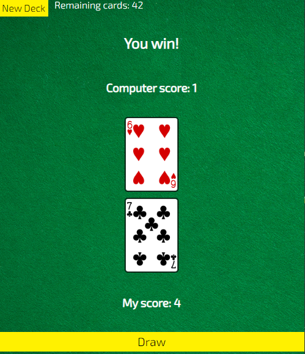
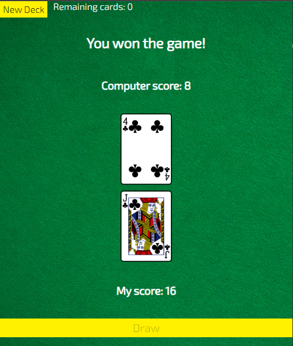

# War Card

## How to play this game:

1. Click the New Deck to start the game.
2. when you click the Draw button you can get two random cards. Then this shows who win the game
3. you can play the game until you reach to 52 cards.

## Languages and Tools are used

1. **Languages**
    + [HTML](https://github.com/topics/html)
    + [HTML5](https://github.com/topics/html5)
    + [CSS](https://github.com/topics/css)
    + [CSS3](https://github.com/topics/css3)
    + [JavaScript](https://github.com/topics/javascript)

2. **Tools**
    + [Chrome](https://github.com/topics/chrome)
    + [VSCode](https://github.com/topics/vscode)
    + [Figma](https://github.com/topics/figma)
