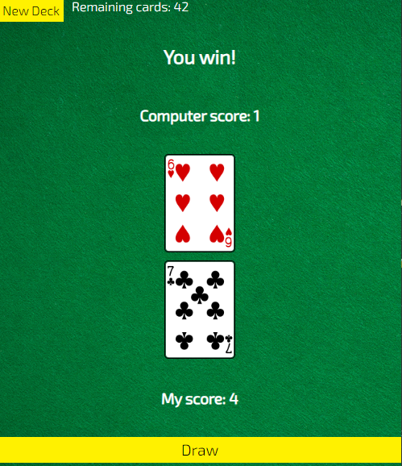
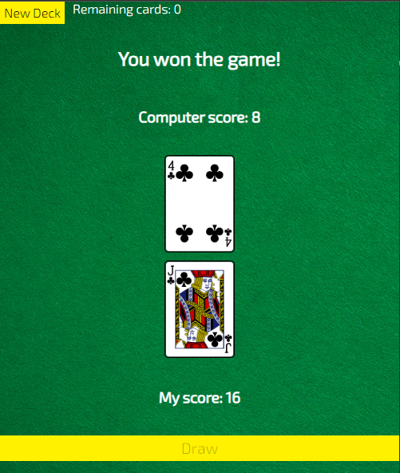
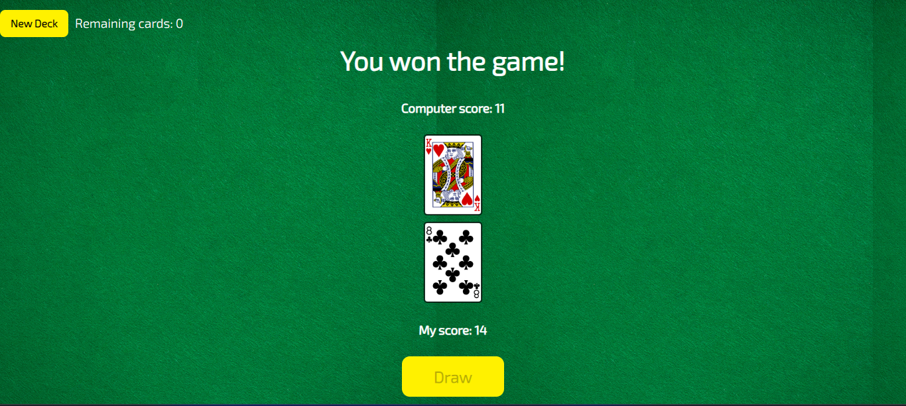

# War Card

[Live Link](https://cards-game-war.netlify.app/)

####  How to play this game: 🤺 ♡

1. Click the New Deck to start the game.
2. when you click the Draw button you can get two random cards. Then this shows who win the game
3. you can play the game until you reach to 52 cards.

----

### Screenshots





------


## Languages and Tools are used 🛠 🗣️

1. **Languages** 🗣️

    + [HTML](https://github.com/topics/html)
    + [HTML5](https://github.com/topics/html5)
    + [CSS](https://github.com/topics/css)
    + [CSS3](https://github.com/topics/css3)
    + [JavaScript](https://github.com/topics/javascript)

2. **Tools** 🔧

    + [Chrome](https://github.com/topics/chrome)
    + [VSCode](https://github.com/topics/vscode)
    + [Figma](https://github.com/topics/figma)
    + [Netlify](https://github.com/topics/netlify)


-----

## For cloning the project 🪛

```
# Clone this repository
$ git clone https://github.com/MastooraTurkmen/War-Card.git

# Go inside the repository
$ cd War-Card
```

---

## Deployment 📥

1. How to deploy our project to the Netlify site?
2. I use [Netlify App](https://app.netlify.com/) for deploying my projects.
4. From there select **_Deploy with Github_**.
5. Then write your project name and select it.
6. After selecting here you can see that the project **_Review configuration for War-Card_** and then select the **_Deploy War-Card_** Button.
7. Now your project is Live.

------

## Author 👩🏻‍💻 

**Mastoora Turkmen**  
[LinkedIn](https://www.linkedin.com/in/mastoora-turkmen/) 
<br>
[Github](https://github.com/MastooraTurkmen/) 
<br>
[Twitter](https://twitter.com/MastooraJ22)
<br>